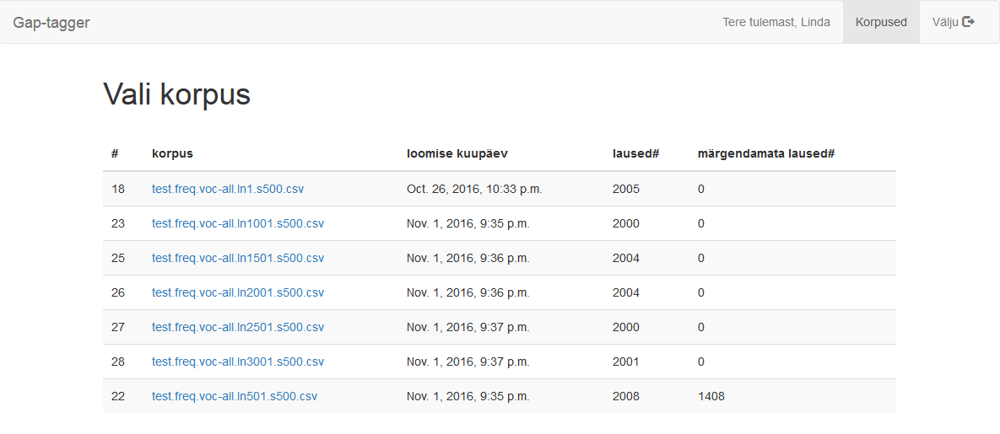
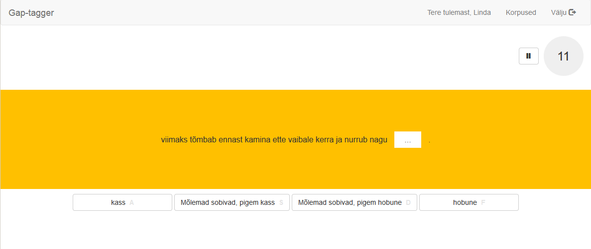
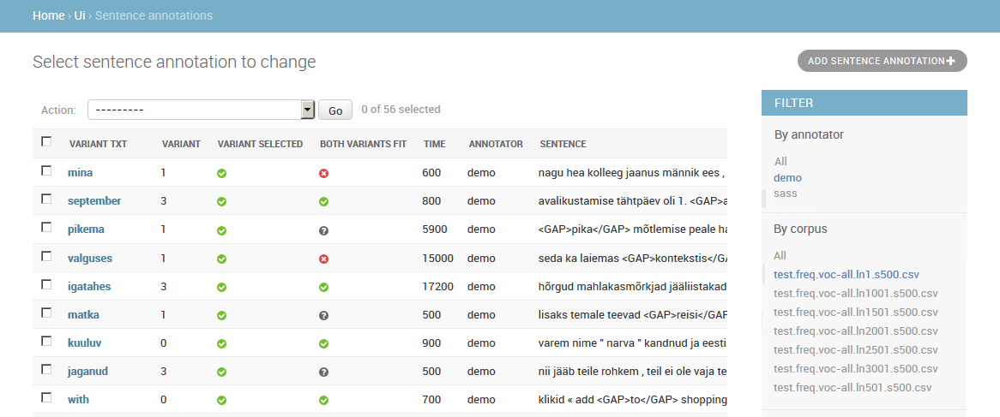

# Gap-tagger
*Gap-tagger* is a web tool which enables to run sentence completion tests online.
Sentence completion test involves a number of questions, where a user is presented with a sentence which contains one missing word, and is asked fill the gap using one of the proposed words.
*Gap-tagger* allows organizers to upload multiple test sets, assign them to multiple users and track results via an administrative interface.

## Installation
See detailed [installation instructions](docs/installation.md).

## Screenshots
The main page lists corpora assigned to a current user:

Once a user picks a corpus to annotate, he is forwarded to the annotation page:

Administration interface enables to monitor annotation progress:

